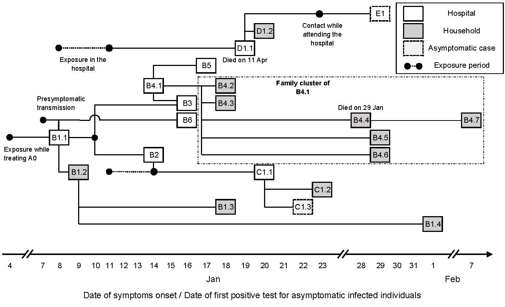

# A hospital-related outbreak of SARS-CoV-2 in Taiwan, January–February 2021

Supporting materials for Akhmetzhanov AR, Jung S-M, Cheng H-Y, Thompson RN. "A hospital-related outbreak of SARS-CoV-2 associated with variant Epsilon (B.1.429) in Taiwan: transmission potential and outbreak containment under intensified contact tracing, January–February 2021" *International Journal of Infectious Diseases* 2021 (doi:[10.1016/j.ijid.2021.06.028](https://www.sciencedirect.com/science/article/pii/S1201971221005178)).

Please see the authors' version: [ms.pdf](https://github.com/aakhmetz/Taiwan-COVID19-end-of-outbreak-JanFeb2021/blob/main/manuscript/2021%20Akhmetzhanov%20et%20al%20IJID%20-%20End-of-outbreak%20Taiwan%20Jan-Feb%202021.pdf)

  

A hospital-related cluster of 22 COVID-19 cases occurred in Taiwan in January 2021. Following proactive testing with intensive contact tracing and isolation, the outbreak was contained. These rigorous measures allowed the outbreak end to be determined with confidence 3 weeks earlier compared to a counterfactual scenario with less intense measures.

### Main notebooks

* [A. Main analysis.ipynb](https://nbviewer.jupyter.org/github/aakhmetz/Taiwan-COVID19-end-of-outbreak-JanFeb2021/blob/main/scripts/Andrei/A.%20Main%20analysis.ipynb) 
* [B. Generation-based Reff.ipynb](https://nbviewer.jupyter.org/github/aakhmetz/Taiwan-COVID19-end-of-outbreak-JanFeb2021/blob/main/scripts/Andrei/B.%20Generation-based%20Reff.ipynb) 

---------
**Thank you for your interest to our work!** 

The first notebook was written in R with Stan used for Bayesian simulations. The second notebook used Python for graphical output of two supplementary figures.

**Words of caution**: We note that the code is not supposed to work out of box, because the links used in the notebooks can be user-specific and some part of the dataset could not be openly shared (e.g. the linelist of COVID-19 that was used for reconstruction of the epicurve). Our main intent was to show the relevance of the methods used in our paper. We are grateful for your understanding in advance.
